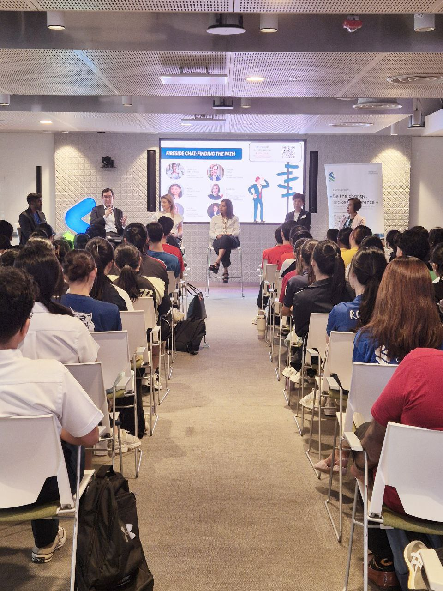

### My Role:
I volunteered to be part of the Operations/Programs team for the <a href="https://www.access-sg.co/programmes#pathways" target="_blank">Access Pathways x D&I Taskforce</a>. In this session, I helped to manage discussion groups, manage administrative matters and coordinate the schedule with the industry partners.

### What Happened?
Standard Chartered Singapore partnered with Access Singapore to engage ~100 junior college students to find out more about the legal industry.

I helped to manage the event by:

1. Take attendance and account for the students in the building.
2. Ensure group discussions start and end in a timely manner.
3. Engage students to participate in the activities.
4. Take nice photos :)

### What I found value in:
Through this program, the students were given an opportunity to understand more about the legal industry. While some students don't seem too interested (which is 100% okay, because they were able to realize that they are not interested in this field), others got intrigued in certain subfields: the applications of legal and tech (e.g. blockchain and it's legal implications).

Through this experience, I realized that early exposure to industries or potential career pathways can be very valuable in finding one's passion. I hope to incorporate this finding to possible initiatives in the future. 

*Introspection*: I thought it would be meaningful to help youths gain some early exposure in AI research, which could then provide the foundation for a vibrant (research) community in Singapore. 

